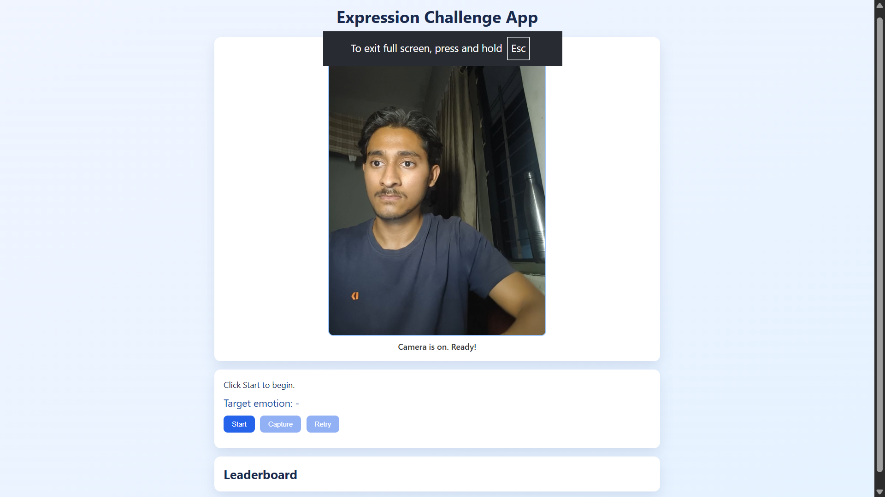
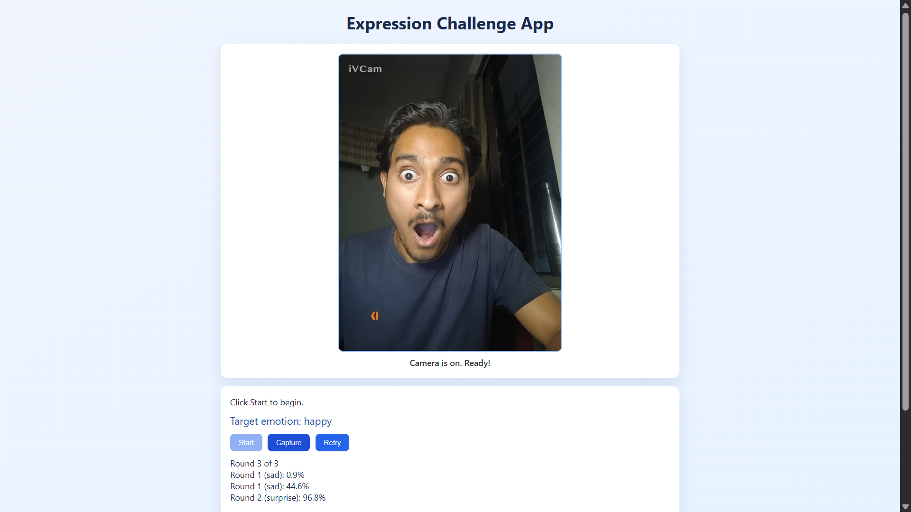
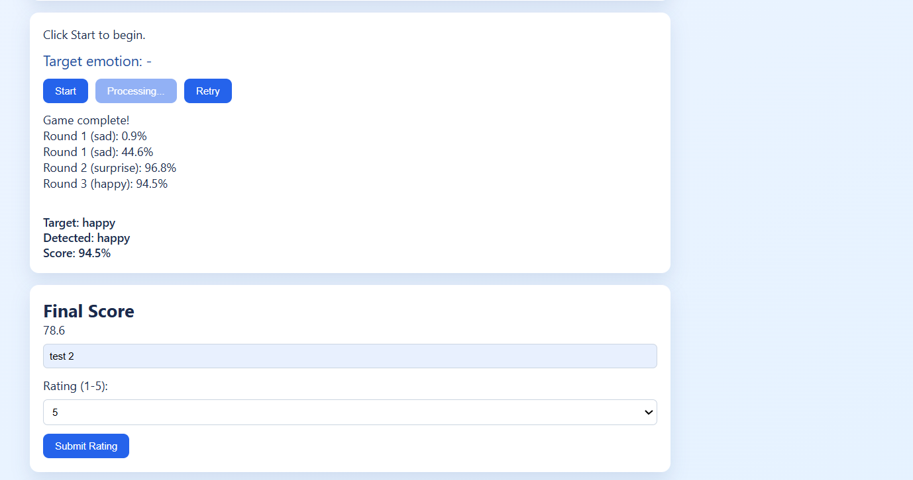

# 🎭 Expression Challenge App

A real-time facial expression game powered by AI 🤖

---

## 📸 Demo

### 🏠 Dashboard


### 🎮 Gameplay


### 🏆 Result


---

## 🧠 System Architecture


---

## 🤖 Model Pipeline


---

## 🚀 Features
- 🎯 Emotion detection using HuggingFace Vision Transformer
- 🎮 Game-based scoring system
- 🔁 Retry / retake feature
- 📷 Real-time webcam interaction

---

## 🧠 Tech Stack
- Python (Flask)
- OpenCV
- HuggingFace Transformers
- JavaScript (Vanilla)

---

## ▶️ Run Locally

### Backend
```bash
cd backend
pip install -r requirements.txt
python app.py